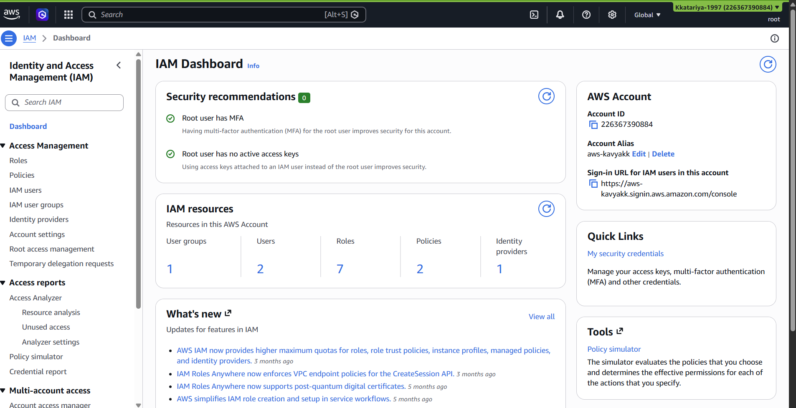
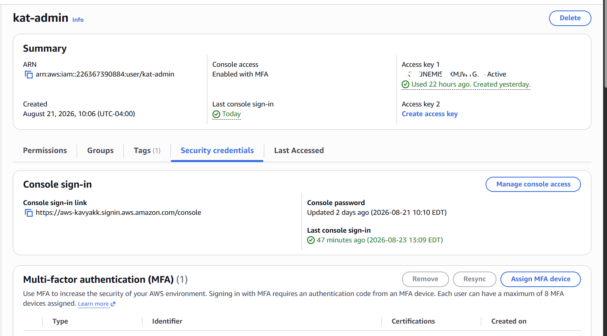
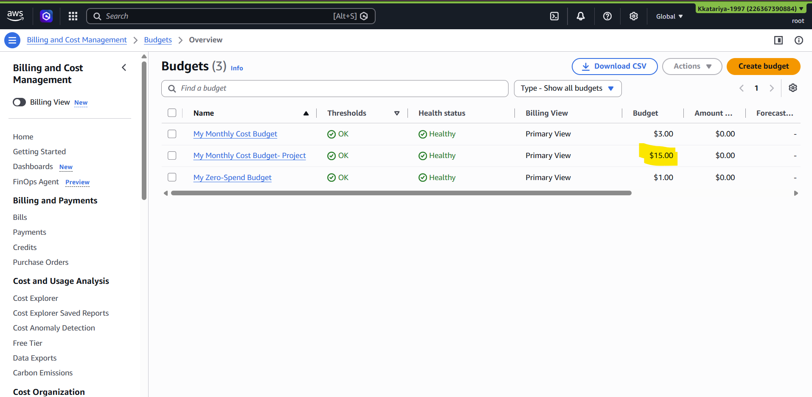
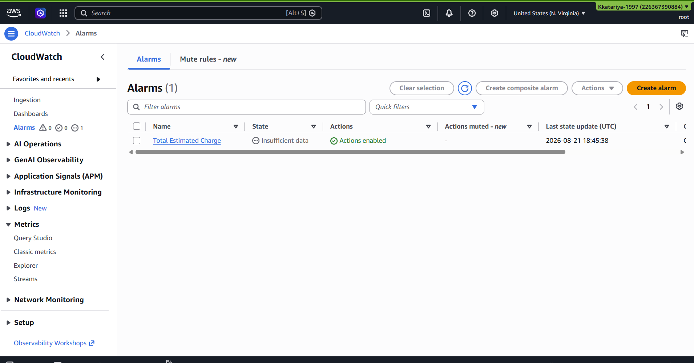
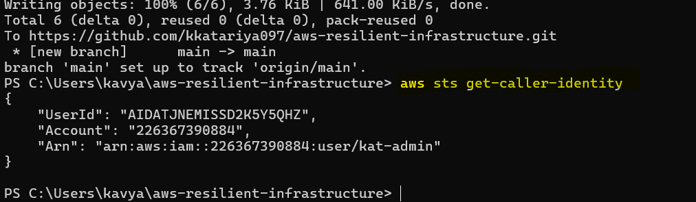

# Phase 0 — Account Foundations

**Status:** ✅ Complete
**Date:** August 2026
**Region chosen:** `ca-central-1` (Canada Central), for lower latency for Canadian users 

## Goal

Before building any infrastructure, lock down the AWS account itself — the account is the highest-value target in the whole project, and getting this wrong is a real security and cost risk, not a hypothetical one. Nothing else in this project starts until this phase is solid.

## What I did

1. **Secured the root user** — enabled MFA (authenticator app), confirmed no access keys exist on root, and set a strong unique password. Root is never used for daily work from this point forward.

2. **Picked one region and standardized on it** — `ca-central-1`, used consistently for every resource in this project.

3. **Created an IAM admin user** (`kat-admin`) instead of continuing to use root, with MFA enabled on the user as well. `AdministratorAccess` is attached for now — intentionally broad, to be replaced with least-privilege policies in Phase 7 once I know exactly what permissions each part of the project actually needs.

4. **Set up billing alarms before creating any billable resources** — an AWS Budget with alerts at 50%/80%/100% of a monthly cap, plus a CloudWatch billing alarm wired to an SNS topic that emails me directly. This account is self-funded, so cost visibility from day one isn't optional.

5. **Installed and configured the AWS CLI** locally, authenticated as the `kat-admin` IAM user (never root), and verified with `aws sts get-caller-identity`.

6. **Confirmed CloudTrail was already logging** management events by default — no action needed, just verified it was there.

7. **Documented everything above** — this file.

## Verification

- [ ] Screenshot: root MFA enabled, zero access keys

- [ ] Screenshot: IAM admin user + MFA

- [ ] Screenshot: AWS Budget created with alert thresholds

- [ ] Screenshot: CloudWatch billing alarm, status OK

- [ ] Terminal output: `aws sts get-caller-identity` showing the IAM user, not root

## Lessons learned

- The CloudWatch alarm creation screen has a "Type" field near the metric graph that looks mandatory and important — it isn't. It only controls how the preview chart is drawn (line, number, bar, etc.) and has zero effect on the alarm's actual behavior. What actually matters for a billing alarm is the **Statistic** (Maximum) and **Period** (6 hours) — easy to get stuck on the wrong field if you don't already know which console elements are cosmetic.
- Billing metrics are only available in `us-east-1` regardless of which region you build in — worth knowing before you go looking for the metric somewhere else.

## Why this matters

Every real company enforces exactly this pattern before anyone touches production: root is locked away and never used day-to-day, every human gets their own least-privilege identity, and cost/usage is visible from the start instead of discovered on an invoice. Skipping this step is one of the most common mistakes in cloud projects built for a portfolio rather than for real use — this project doesn't skip it.
