# Phase 1 — Custom Networking

**Status:** ✅ Complete
**Date:** August 2026
**Region chosen:** `ca-central-1` (Canada Central), for lower latency for Canadian users 

## Goal

Build a VPC by hand — not through the console's automatic wizard — across two Availability Zones, with a clean split between public subnets (internet-facing) and private subnets (no direct internet access), and prove the routing actually behaves as designed before building anything on top of it.

## Architecture

| Component | CIDR | AZ | Purpose |
|---|---|---|---|
| VPC (`battle-scars-vpc`) | `10.0.0.0/16` | — | Container for everything below |
| `public-subnet-a` | `10.0.0.0/24` | A | Load balancer, NAT Gateway |
| `public-subnet-b` | `10.0.1.0/24` | B | HA pair for public-subnet-a |
| `private-subnet-a` | `10.0.10.0/24` | A | App servers / database |
| `private-subnet-b` | `10.0.11.0/24` | B | HA pair for private-subnet-a |

- **Internet Gateway** (`battle-scars-igw`) attached to the VPC — the only path in/out for public subnets.
- **NAT Gateway** in `public-subnet-a` with an Elastic IP — gives private subnets outbound-only internet access, with zero inbound exposure.
- **`public-rt`**: `0.0.0.0/0` → Internet Gateway, associated with both public subnets.
- **`private-rt`**: `0.0.0.0/0` → NAT Gateway, associated with both private subnets.
- **Security groups**: `web-sg` (80/443 from `0.0.0.0/0`, will attach to the ALB in Phase 2), `app-sg` (80 from `web-sg` only — app tier only accepts traffic that already passed through the load balancer).

## Diagram 
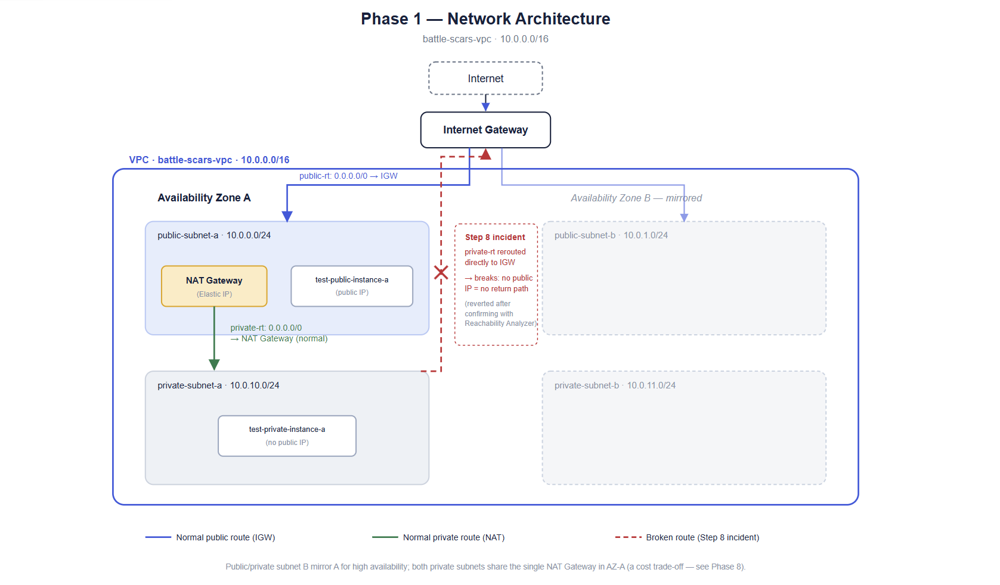

## What I did

1. Created the VPC and all four subnets by hand (not the "VPC and more" wizard), across two AZs for the high-availability requirement this whole project is built around.
2. Created and attached the Internet Gateway.
3. Created the NAT Gateway with an allocated Elastic IP in `public-subnet-a`.
4. Created `public-rt` and `private-rt`, wired each to the correct target, and associated them with the matching subnets.
5. Created baseline security groups (`web-sg`, `app-sg`) with least-privilege inbound rules — `app-sg` only trusts traffic from `web-sg`, not from any IP range.
6. **Verified the design with two throwaway EC2 instances** rather than assuming the config was correct:
   - `test-public-instance-a` (`i-070790036031e0352`) in `public-subnet-a`, with a public IP.
   - `test-private-instance-a` (`i-09968f43d3450c461`) in `private-subnet-a`, with **no** public IP.
   - Connected to both through **AWS Systems Manager Session Manager** — no SSH key pair, no open port 22 on either instance. Access was entirely through an IAM instance role (`ec2-ssm-role`, policy `AmazonSSMManagedInstanceCore`), not a network rule.
   - From both instances, `curl -I https://amazon.com` returned `HTTP/1.1 301 Moved Permanently` — confirming the public instance reaches the internet via the IGW, and the private instance reaches it via the NAT Gateway, despite having no direct exposure at all.
7. **Deliberately broke it**: changed `private-rt`'s `0.0.0.0/0` route from the NAT Gateway to the Internet Gateway, then re-ran the same `curl` test from `test-private-instance-a`.
   - Result:  did curl but, it hang and time out, and fail immediately? Blank screen.
   - Why this happens: an Internet Gateway can only return traffic to instances that have a public IP mapped via 1:1 NAT. `test-private-instance-a` has no public IP, so even though outbound packets now had a route to the IGW, there was nowhere for the response to come back to — the request stalls rather than resolving.
   - Fixed it by reverting `private-rt`'s route back to the NAT Gateway, then re-confirmed `curl` succeeded again.
   - Time from breaking it to confirming the fix: It was quick. 
8. Terminated both test instances — their job was to prove the network, not to persist into Phase 2, where compute gets rebuilt properly behind an Auto Scaling group.

## Verification

- [x] Created VPC 
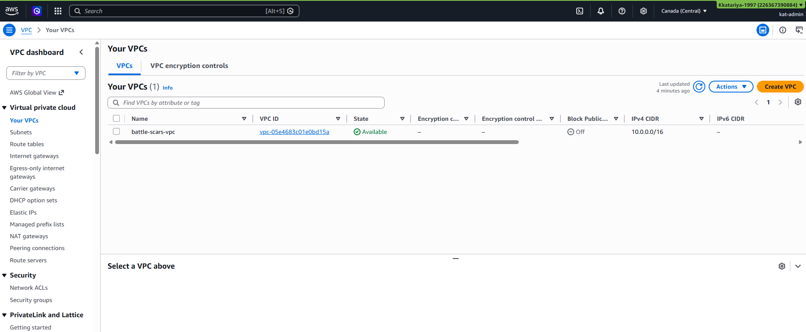

- [x] Created four subnets across two AZs
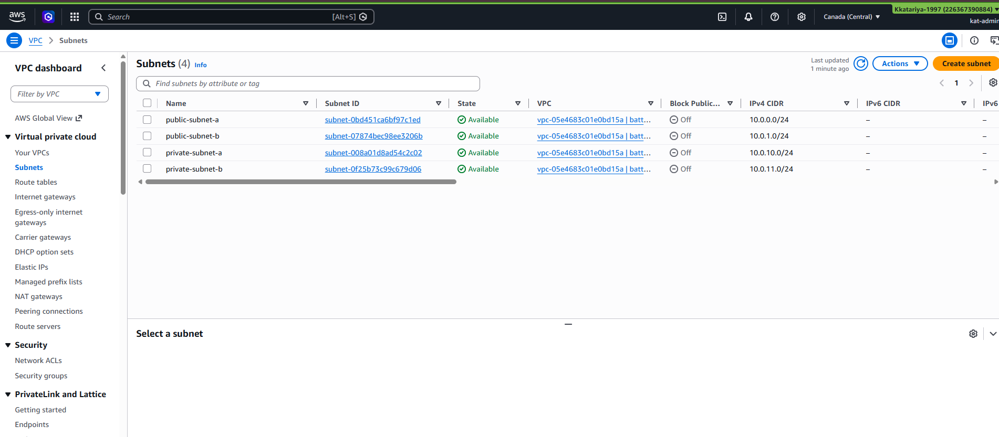

- [x] Route tables created
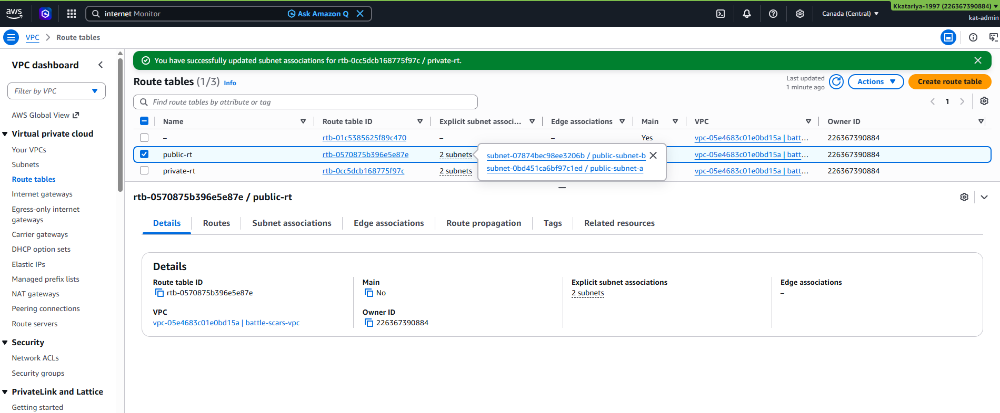

- [x] EC2 instances creation
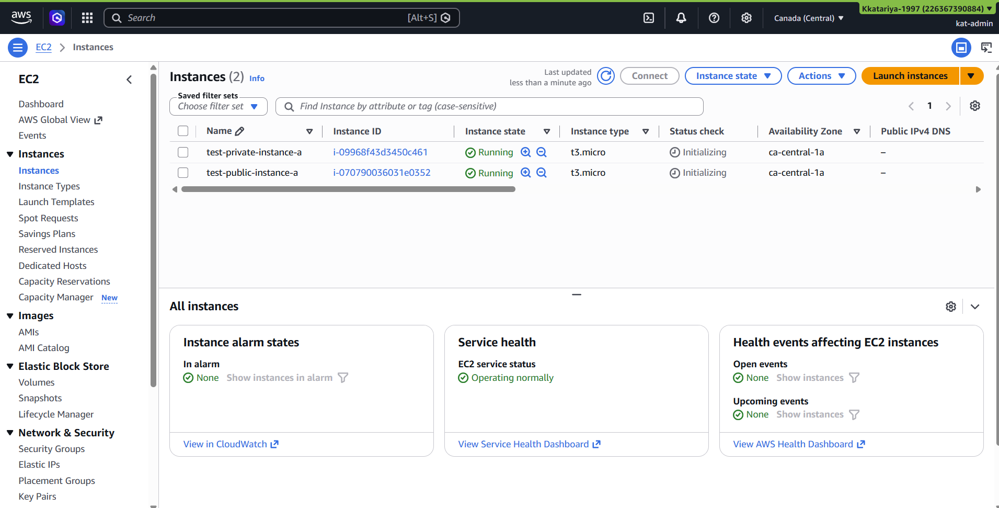

- [x] Security Groups creation
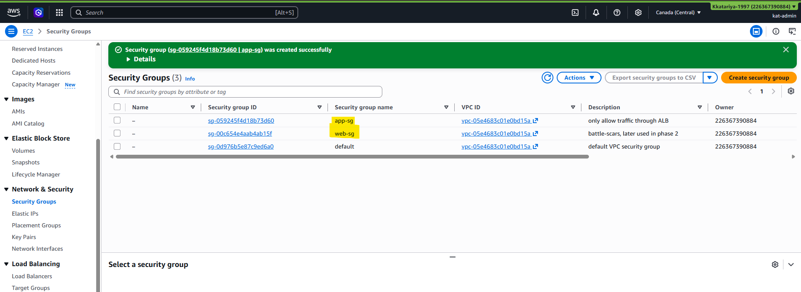

- [x] `curl -I https://amazon.com` succeeds from the public instance via IGW
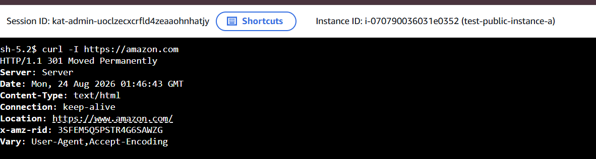

- [x] Same command succeeds from the private instance via NAT Gateway, with no public IP and no inbound rule
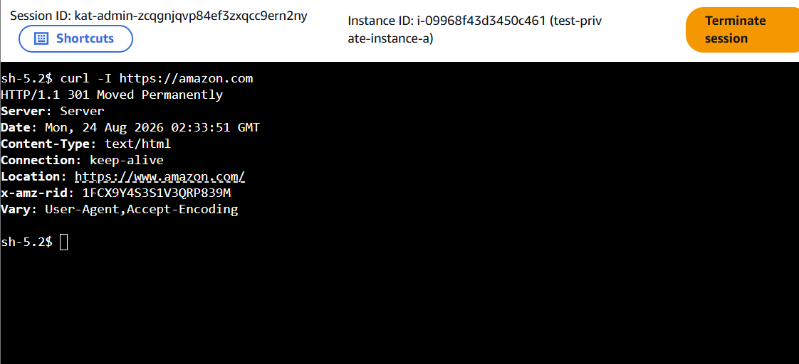

- [x] Both instances reachable only via SSM Session Manager — no SSH keys, no open port 22, Created IAM Role for EC2 
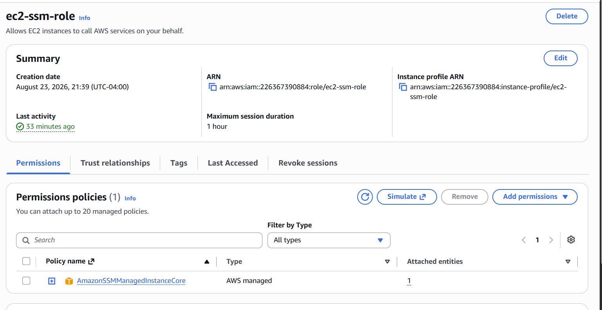

- [x] Rerouting the private subnet to the IGW breaks outbound connectivity, confirmed with Reachability Analyzer
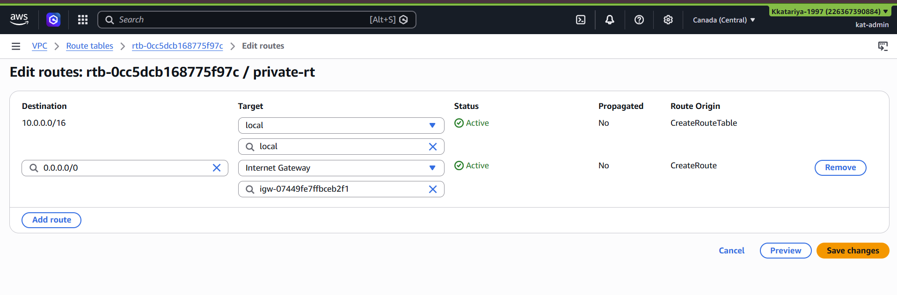

- [x] Retry to connect after private subnet to IGW - Not Working
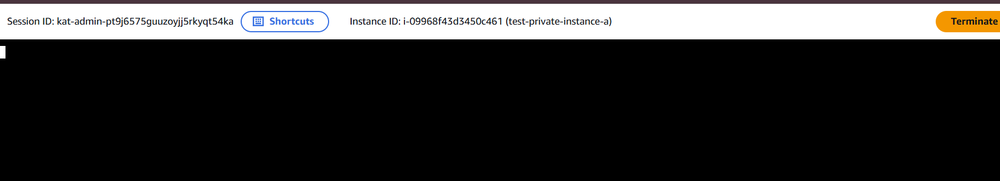

- [x] To fix, again Changed the private subnet to NAT Gateway and reopened SSM Session for private instance
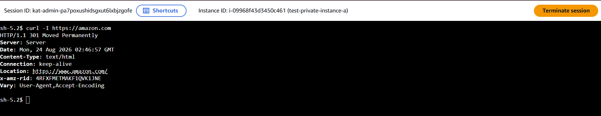

## Lessons learned

- A subnet is "public" or "private" *only* because of its route table association — nothing else about the subnet itself changes. That's what made the break-it drill possible: same subnet, same instance, one route changed, entirely different network behavior.
- An Internet Gateway can't return traffic to an instance without a public IP — rerouting to it doesn't just "not help," it actively breaks connectivity for a private instance, because outbound packets leave but nothing can find its way back.
- Systems Manager Session Manager removes the need for SSH keys or an open port 22 entirely, as long as the instance has an IAM role with `AmazonSSMManagedInstanceCore` and a path to the SSM endpoints. Worth using by default going forward, not just for this test.

## Why this matters

This is the exact pattern real companies use to separate a public-facing tier from an internal one: not a firewall rule bolted on after the fact, but a routing decision baked into the network design itself. 

Being able to explain *why* rerouting broke connectivity — not just that it did — is the difference between having memorized VPC concepts for an exam and actually understanding how AWS networking behaves.

