# Phase 2 — Compute and Load Balancing

**Status:** ✅ Complete
**Date:** August 2026
**Region:** `ca-central-1` (Canada Central)

## Goal

Put real, load-balanced compute behind the network built in Phase 1: EC2 instances in an Auto Scaling Group, living in the private subnets, reachable only through an Application Load Balancer in the public subnets — then prove the whole chain actually works under real traffic, not just that it deploys cleanly.

## Architecture

| Component | Detail |
|---|---|
| Launch Template (`battle-scars-app-lt`) | Amazon Linux 2023, `t3.micro`, no key pair (SSM-only management), security group `app-sg`, IAM role `ec2-ssm-role`, user data installs nginx and serves a page showing the responding instance ID and AZ |
| Target Group (`battle-scars-tg`) | HTTP:80, target type Instance, health check path `/` |
| Application Load Balancer (`battle-scars-alb`) | Internet-facing, spans `public-subnet-a` + `public-subnet-b`, security group `web-sg`, listener HTTP:80 → `battle-scars-tg` |
| Auto Scaling Group (`battle-scars-asg`) | Subnets: `private-subnet-a` + `private-subnet-b`, attached to `battle-scars-tg` with ELB health checks on, Desired 2 / Min 2 / Max 4, target tracking on Average CPU Utilization at 50% |

## Diagram 
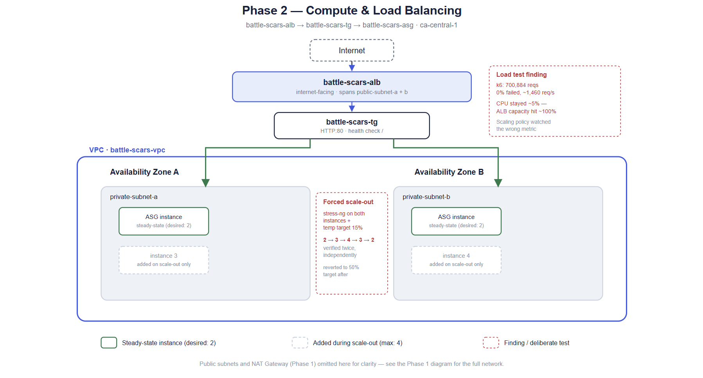

## What I did

1. Built the launch template with a small nginx app (via user data) that reports back which instance served the request — necessary to actually *see* load balancing happen, not just assume it.
2. Created the target group, the ALB across both public subnets, and the ASG across both private subnets, reusing `web-sg` and `app-sg` from Phase 1 exactly as they were designed for.
3. **Verified load balancing directly**: hit the ALB's DNS name (`battle-scars-alb-383484866.ca-central-1.elb.amazonaws.com`) repeatedly and confirmed responses alternated between both instances (`i-02300d4f961f75359` in `ca-central-1b`, `i-06497a91cd0a0c9f3` in `ca-central-1a`) — real proof, not assumed behavior.
4. **Ran a load test with k6**: 150 virtual users for 8 minutes against the ALB. Result: 700,884 requests, 0% failed, ~1,460 req/s sustained, average latency 102ms.
5. **Discovered the scaling metric didn't match the actual bottleneck**: despite that request volume, EC2 CPU barely moved (topped out ~4–5% during the test window). The ALB's own Capacity Utilization metric spiked toward 100% in the same window instead — the real pressure was on the load balancer's capacity (connections/bandwidth/rule evaluations), not application CPU, because serving one static file is computationally cheap regardless of request volume.
6. **Forced a real CPU-based scale-out** to validate the mechanism directly rather than relying on the k6 test: installed and ran `stress-ng` on the instances via Session Manager. Hit and resolved a `dnf` "temp-path" error along the way (fixed by running from `/tmp` instead of the SSM session's default working directory).
7. First attempt stressed only one instance — group average capped at 48.3%, just under the 50% target, and never sustained a breach. This is expected, not a bug: with two instances, stressing only one can mathematically only bring the group average to ~50% (one at ~100%, one at ~0%), never clearly past it.
8. Temporarily lowered the target tracking threshold to 30% and stressed **both** instances simultaneously to force a fast, unambiguous, verifiable scale-out rather than waiting on an uncertain organic trigger.
9. **Result**: two clean, complete scale-out/scale-in cycles — instance count rose from 2 → 3 → 4, held, then scaled back down through 3 → 2, twice independently. Confirmed via the ASG's `GroupTotalInstances` metric and the target group showing 2/2 healthy targets at rest.
10. Reverted the target tracking threshold back to the realistic 50%, stopped `stress-ng` on both instances, and confirmed the group settled back to steady state (2 healthy, 0 unhealthy).
11. With region and free-tier eligibility uncertain, wound the environment back down after capturing evidence (ASG to 0, ALB and NAT Gateway deleted, Elastic IP released) to keep cost under control — see Lessons Learned.

## Verification
- [x] Launch template creation 
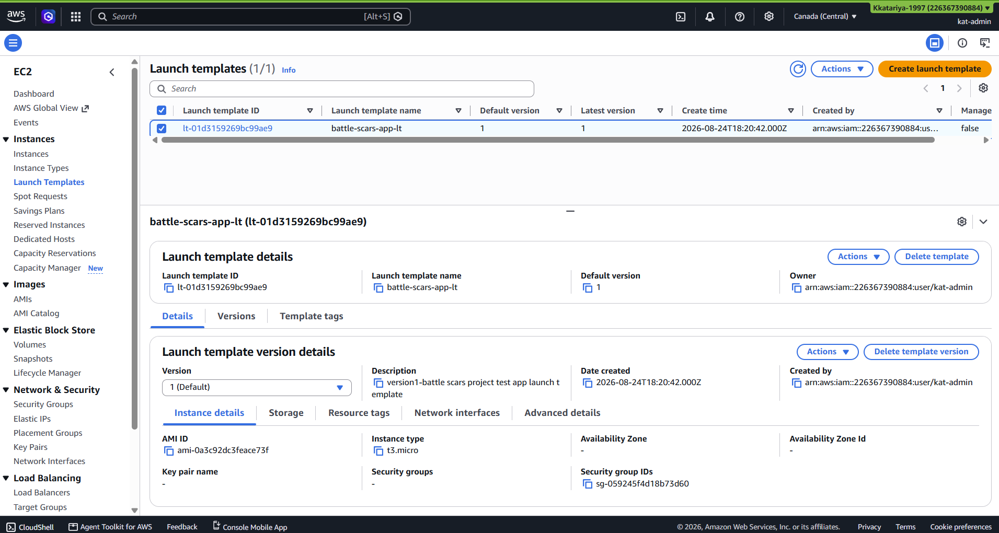

- [x] Target Group Creation 
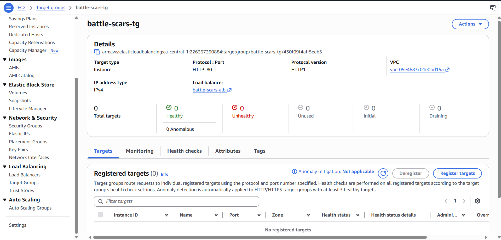

- [x] ALB Creation 
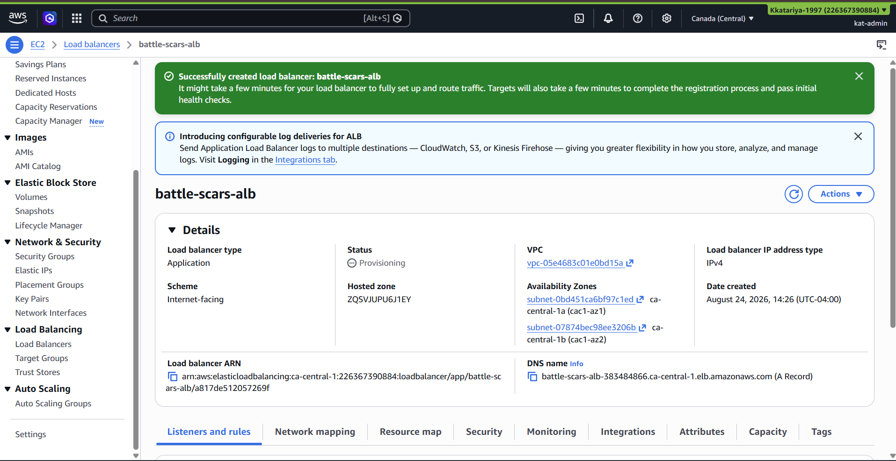

- [x] Auto Scaling Group Creation 
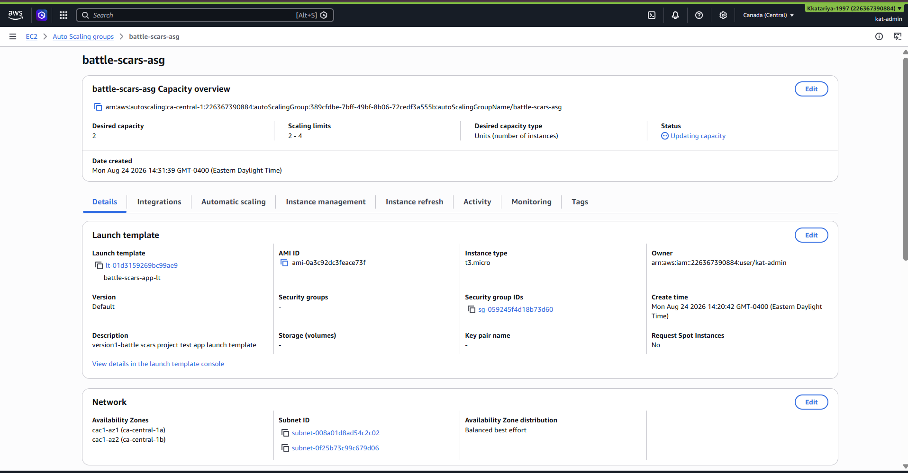

- [x] Instance check, Both Healthy
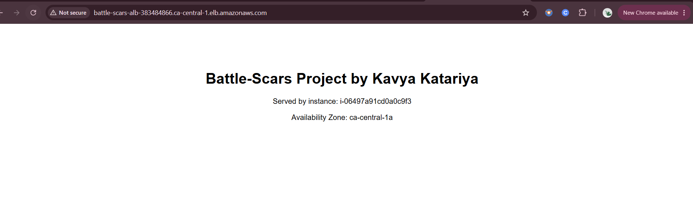
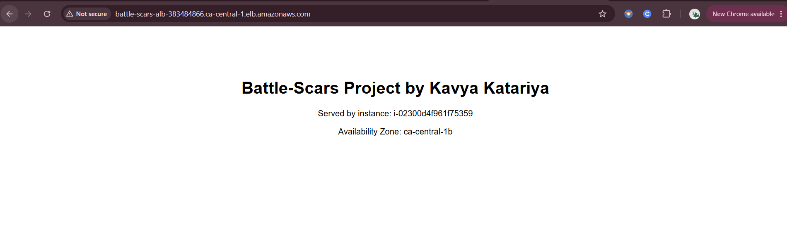

- [x] k6 load test: 700,884 requests, 0% failure rate, ~1,460 req/s sustained
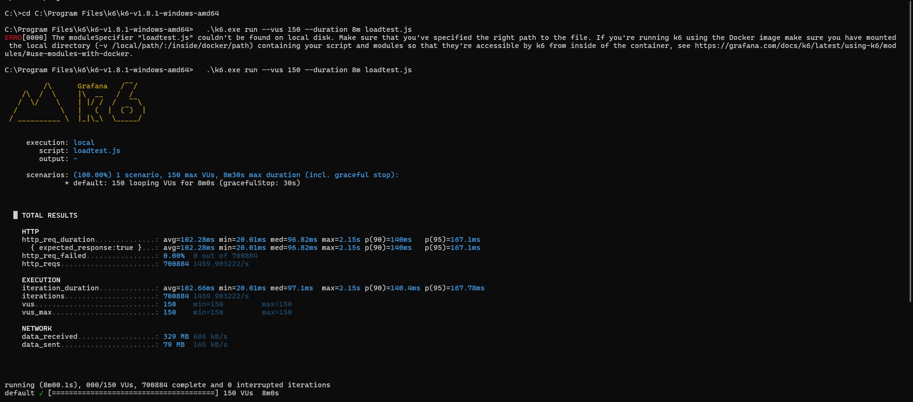

- [x] CPU utilization confirmed to stay low under pure request-volume load (static content)
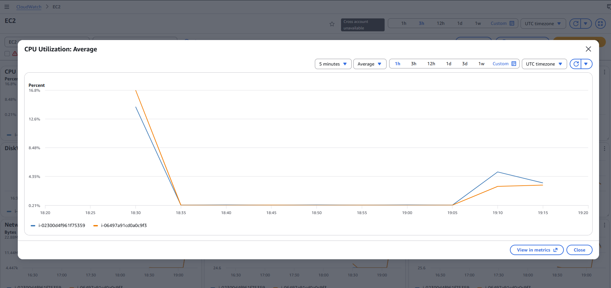

- [x] ALB Capacity Utilization confirmed to spike under the same load — the actual bottleneck
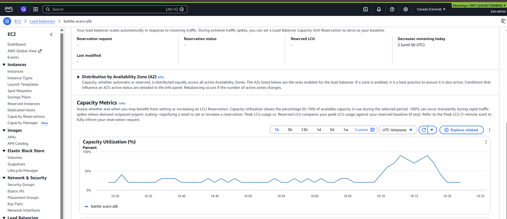

- [x] `stress-ng`-forced CPU load produced two verified, complete scale-out/scale-in cycles (2→4→2)
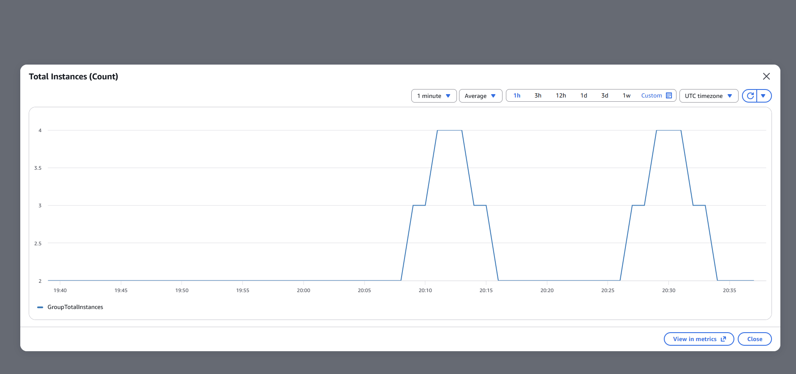

- [x] Target group returned to steady state: 2 healthy, 0 unhealthy
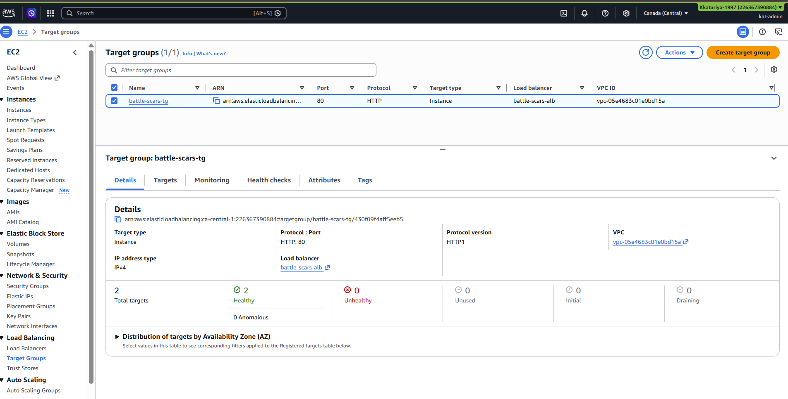

## Lessons learned

- **A scaling metric only works if it tracks your actual bottleneck.** CPU-based target tracking is the default almost everyone reaches for, but it's meaningless if your workload's real constraint is somewhere else — here, it was the load balancer's own capacity, not the application tier's CPU. This is worth checking *before* choosing a scaling metric, not after watching it fail to react.
- **Group-average scaling metrics have real arithmetic limits.** In a 2-instance group, fully loading only one instance can never push the average past 50% — you have to load the group, not an instance, to validate group-level scaling behavior.
- **Forcing a condition beats waiting for one**, when the goal is validating a mechanism on a schedule you control. Temporarily lowering a threshold to 15% to get a fast, unambiguous scale-out — then reverting it — is a legitimate, common testing technique, not a shortcut to hide.
- `dnf`'s "temp-path '.' must be readable and writeable" error was fixed by running from `/tmp` — a small, common environment quirk on Amazon Linux SSM sessions, not a real permissions problem.
- `<add anything else that surprised you or took longer than expected>`

## Why this matters

Most portfolio projects show a load balancer and an Auto Scaling Group configured correctly and stop there. This phase went further: it found a case where the configured scaling behavior *looked* correct but wouldn't have actually protected the application under this specific workload, diagnosed why using two different CloudWatch metrics, and then independently verified the scaling mechanism itself works exactly as designed once given a workload that actually exercises it. That diagnostic path — metric doesn't match assumption, find the real signal, verify the mechanism separately — is the actual job in cloud support and cloud engineering roles, more than the initial setup ever is.
