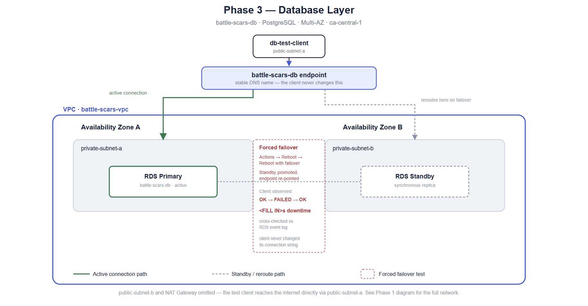
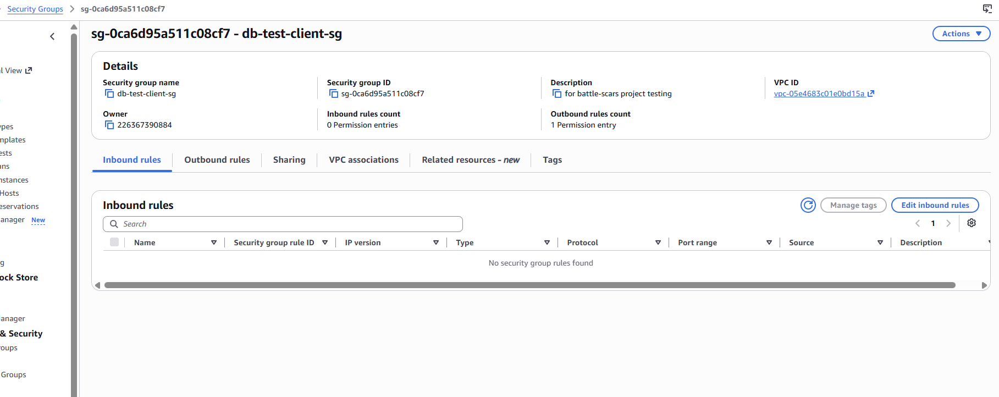
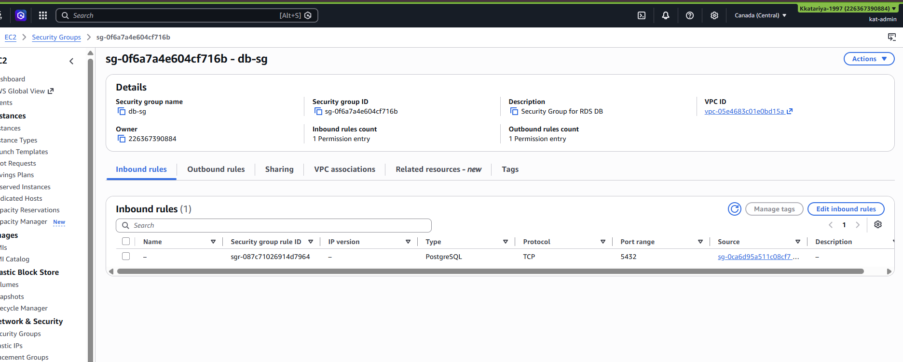
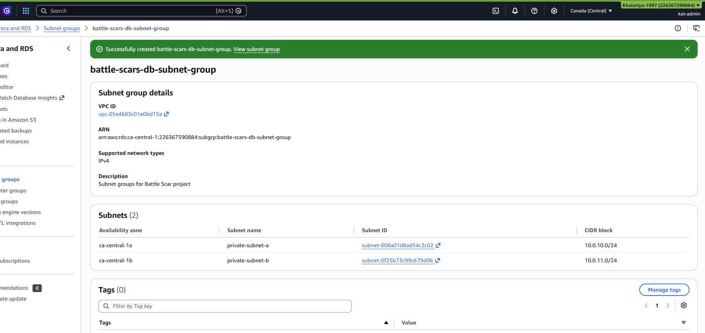
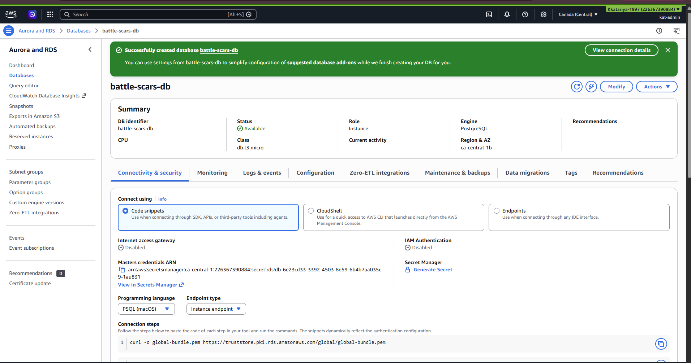
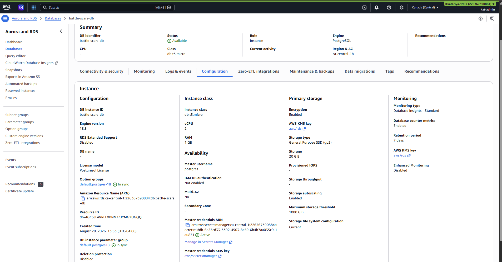
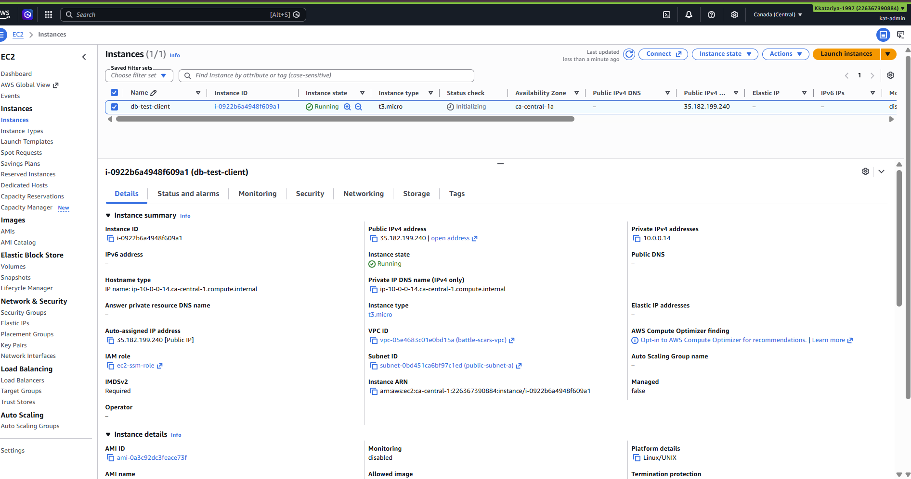
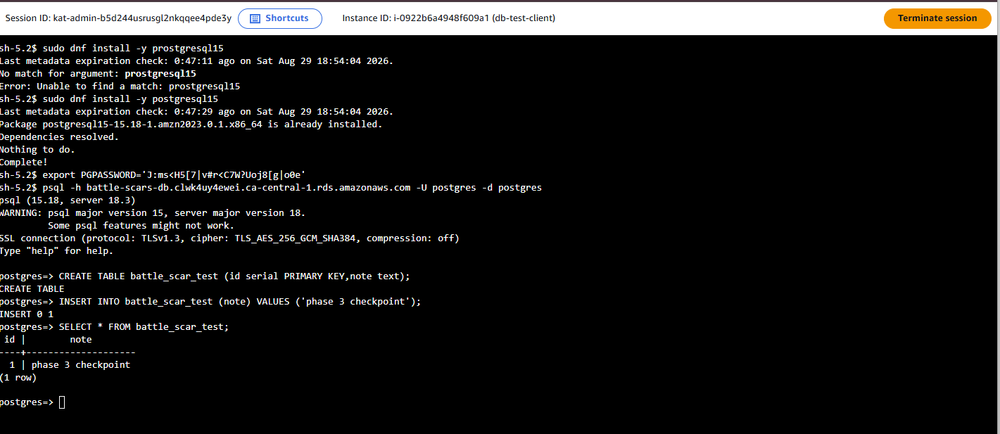
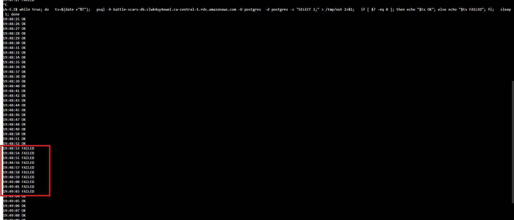
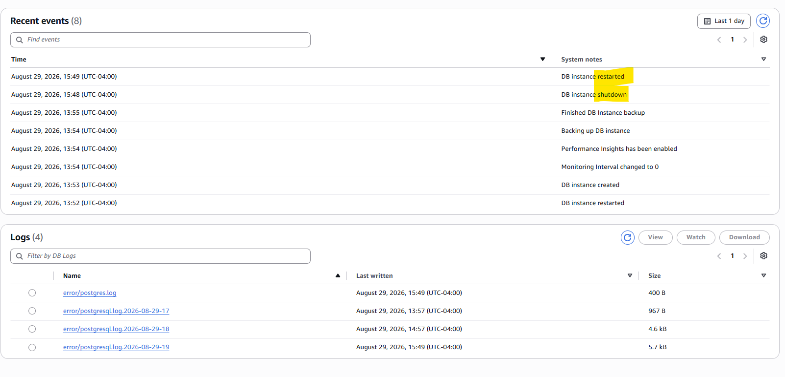

# Phase 3 — Database Layer

**Status:** ✅ Complete
**Date:** August 2026
**Region:** `ca-central-1` (Canada Central)

## Goal

Add a Multi-AZ PostgreSQL database behind the network from Phase 1 — private, least-privilege, credentials never hardcoded — and prove high availability isn't just a checkbox by forcing a real failover and measuring exactly how long it actually took, from the perspective of a client mid-connection.

## Architecture

| Component | Detail |
|---|---|
| Security group (`db-test-client-sg`) | No inbound rules — a temporary client only needs outbound |
| Security group (`db-sg`) | Inbound 5432 (PostgreSQL) from `db-test-client-sg` only — least privilege, same pattern as `app-sg` trusting only `web-sg` |
| DB subnet group (`battle-scars-db-subnet-group`) | `private-subnet-a` + `private-subnet-b` |
| RDS instance (`battle-scars-db`) | PostgreSQL, `db.t3.micro`, 20 GB, **Multi-AZ**, public access disabled, credentials managed in AWS Secrets Manager (no password ever typed into a config file) |
| Test client (`db-test-client`) | Temporary EC2 instance in `public-subnet-a`, SSM-managed (`ec2-ssm-role`), used only to prove connectivity and run the failover test |

Deliberately routed the test client through the public subnet rather than rebuilding the Phase 1 NAT Gateway — since nothing private needs outbound internet access for this phase, that would have been cost with no benefit.

## Diagram 

## What I did

1. Created `db-test-client-sg` (no inbound rules) and `db-sg` (inbound 5432 from `db-test-client-sg` specifically, not a CIDR range).
2. Created the DB subnet group spanning both private subnets.
3. Created `battle-scars-db`: PostgreSQL, `db.t3.micro`, Multi-AZ enabled, public access off, master credentials managed by Secrets Manager rather than set manually.
4. Launched `db-test-client` in the public subnet, connected via Session Manager (no SSH, same pattern as every instance so far), installed the PostgreSQL client (`postgresql15` via `dnf`).
5. Retrieved connection details: the RDS endpoint from the console, credentials from the Secrets Manager secret. Noted for the record: manually copying credentials like this is acceptable for a throwaway test client, but a real production setup would grant the instance's IAM role `secretsmanager:GetSecretValue` directly instead — exactly what Phase 7 will formalize.
6. Connected with `psql`, created a test table, and inserted a row to confirm read/write access end to end.
7. Set up a continuous connectivity loop on the test client — one query per second, timestamped OK/FAILED — and left it running.
8. Triggered a real failover: RDS console → `battle-scars-db` → **Actions → Reboot → Reboot with failover**.
9. Watched the loop transition from OK → FAILED → OK, and cross-checked the exact duration against RDS's own event log.
10. Deleted `battle-scars-db` (no final snapshot, since this was a test instance) and terminated `db-test-client` immediately after capturing evidence, to keep Multi-AZ costs from accumulating past this test.

## Verification

- [x] Security group creation - `db-test-client-sg` (no inbound rules)

- [x] Another Security Group creation - `db-sg` 

- [x] Subnet Group Creation - both private subnets

- [x] RDS Creation 

- [x] RDS CloudWatch Dashboard Screenshot
[RDS Cloudwatch dashboard](images/ss_32_rds_cpu.png)

- [x] RDS Configuration

- [x] EC2 Test Connection 

- [x] Connected via `psql`, created and queried a real table

- [x] Continuous ping loop confirmed connectivity before, during, and after a forced failover

- [x] Measured downtime: **10 seconds** - exact duration from your OK → FAILED → OK transition, Cross-checked against RDS's own event log: it indicated that DB instance shutdown and restarted

## Lessons learned

- **"Multi-AZ" is a claim until you measure it.** The setting is one checkbox; the actual guarantee is only real once you've forced a failover and timed the gap yourself. Noticed, it taks only 10 seconds to restart the instance, it was really faster than what i expected. 

- **Managed credentials remove an entire class of mistakes.** Letting Secrets Manager own the master password meant there was never a plaintext password to accidentally commit to a repo or paste somewhere it shouldn't be — worth defaulting to on every RDS instance from here on.

- **Routing around a torn-down piece of infrastructure is sometimes the right call, not a shortcut.** Using the public subnet for a throwaway test client instead of rebuilding the NAT Gateway saved real cost with zero loss of what the test needed to prove.

## Why this matters

Anyone can enable a checkbox labeled "Multi-AZ" and claim high availability on a resume. Far fewer people have actually forced the failover, watched real requests fail and recover, and can state a real number for how long it took — that's the difference between describing a feature and having operated one, and it's exactly the kind of specific, defensible detail an interviewer keeps asking follow-up questions about instead of moving on.
